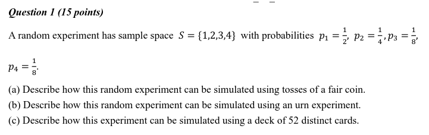
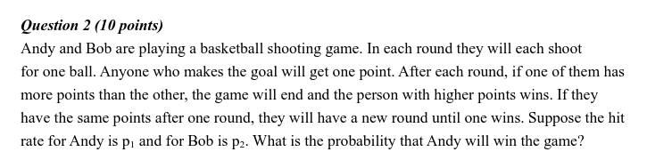
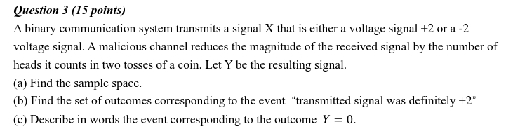
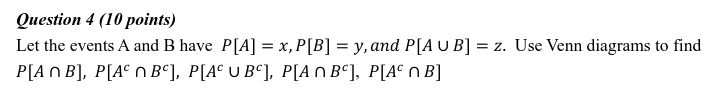
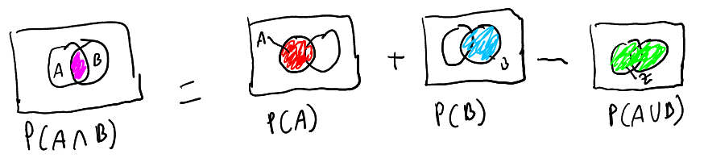
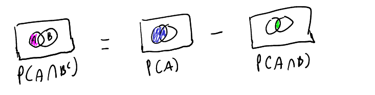
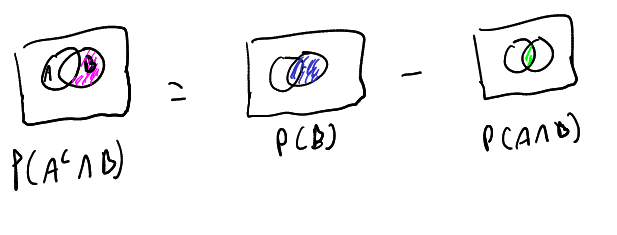
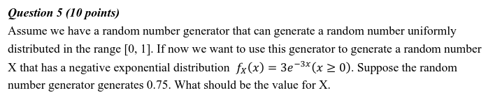
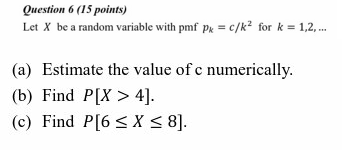
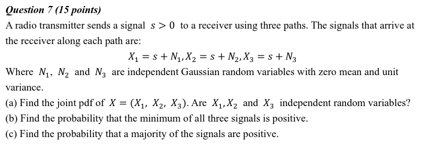

# ELEC3810 HW1

## Q1.

### (a) 

This can be simulated with a random experiment of tosses with fair coin where we toss the coin three times and record the side it flips. The possible outcomes are: 
${(H,H,H),(H,H,T),(H,T,H),(T,H,H),(H,T,T),(T,H,T),(T,T,H),(T,T,T)}$. 

Using sample space "1" as the probability of landing heads at least twice, we get $p_{1}=4/8=1/2$.

Using sample space "2" as the probability of landing heads or tails 3 times in a row, we get $p_{2}=2/8=1/4$.

Using sample space "3" as the probability of landing heads, heads, then tails in the exact order, we get $p_{3}=1/8$.

Using sample space "4" as the probability of landing heads, tails, then tails in the exact order, we get $p_{4}=1/8$.

### (b)

This sample space and probabilities can be simulated with urn experiment by placing and labelling 8 balls in the urn with the numbers 1,2,3,4. We label four balls with the number 1, two balls with the number 2, one ball with number 3 and one ball with number 4. We draw one ball from the urn and look at the number labelled on the ball. The sample space corresponds to the ball's number drawn from the urn. 

Therefore probability of drawing ball with label "1" = $p_{1}=1/2$, probability of drawing ball with label "2" is $p_{2}=1/4$, probability of drawing ball with label "3" is $p_{3}=1/8$, probability of drawing ball with label "4" is $p_{4}=1/8$.

### (c)

To simulate this sample space and probability with deck of 52 distinct cards, we define a random experiment where each time we pick a card we will note the colour of the card, place the card back to the deck and re-shuffle the deck. We repeat this 3 times.

Using sample space "1" as the probability of getting at least two cards that are red, we get $p_{1}=1/2$.

Using sample space "2" as the probability of getting the same coloured card three times in a row, we get $p_{2}=1/4$.

Using sample space "3" as the probability of getting red, red, then black in the exact order, we get $p_{3}=1/8$.

Using sample space "4" as the probability of getting black, red, black in the exact order, we get $p_{4}=1/8$.

## Q2.

Andy win scenarios:

- P(Andy hits and Bob misses) = ${p_1 * (1-p_2)}$

- P(First round same points, Andy wins new round) = (P(Both misses) + P(Both hits)) * P(Andy wins) = ${((1 - p_1) * (1 - p_2) + p_1 * p_2) * P(\textrm{Andy wins})}$

Therefore, 

P(Andy wins) = P(Andy hits and Bob misses) + P(First round same points, Andy wins new round)

P(Andy wins) = ${p_1 * (1-p_2) + (((1 - p_1) * (1 - p_2) + p_1 * p_2) * P(\textrm{Andy wins}))}$

P(Andy wins) = ${\frac{p_1 *(1-p_2)}{(p_2 + p_1 - 2*p_1*p_2)}}$

## Q3. 

### (a) 

Sample space of Y is {-2,-1,0,1,2}.

When 0 total heads: ${(X = -2, Y = -2), (X = +2, Y = +2)}$

When 1 total heads: ${(X = -2, Y = -1), (X = +2, Y = +1)}$

When 2 total heads: ${(X = -2, Y = 0), (X = +2, Y = 0)}$

### (b)

Set of outcomes with event "transmitted signal was definitely +2" (ie. X=+2): {${Y = +2,\ Y = +1}$}

### (c)

To get the outcome Y = 0, we must obtain 2 heads in the two tosses of the coin. The input X cannot be determined as X can either be +2 or -2.

## Q4. 

${P(A \cap B)}$ = x + y - z

${P(A^c \cap B^c)}$ = 1 - z

${P(A^c \cup B^c)}$ = 1 - $P(A \cap B)$ = 1 - (x + y - z) = 1 + z - x - y

${P(A \cap B^c)}$ = ${P(A)}$ - ${P(A \cap B)}$ = x - (x + y - z) = z - y

${P(A^c \cap B)}$ = ${P(B)}$ - ${P(A \cap B)}$ = y - (x + y - z) =  z-x

<!-- 1-z+y -->

## Q5.

CDF of ${f_x(x)}$ is ${F_x(x) = \int_{-\infty}^{0} 0 dx + \int_{0}^{\infty}3e^{-3x}dx }$

= ${(-e^{-3t})|_0^x}$

therefore ${F_x(x) = 1 - e^{-3x}}$, to get value for X that will generate 0.75:

${0.75 = 1 - e^{-3x}}$

${x = -ln(0.25) / 3}$

x = 0.462

## Q6.

### (a)

${\sum_{k=1}^\infty p_k = 1}$

${\sum_{k=1}^\infty \frac{c}{k^2} = 1}$

${c * \sum_{k=1}^\infty \frac{1}{k^2} = 1}$

Since ${\sum_{n=1}^\infty \frac{1}{n^2} = \frac{\pi^2}{6}}$, therefore:

${c * \frac{\pi^2}{6} = 1}$

${c = \frac{6}{\pi^2}}$ or ${c\approx{0.6079}}$

### (b)

${P(X>4) = 1 - P(X<=4)} = 1 - c * \sum_{k=1}^4 \frac{1}{k^2} = 1 - \frac{6}{\pi^2}(1+ \frac{1}{4} + \frac{1}{9} + \frac{1}{16})$

= 0.1345

### (c)

${P(6 \le X \le8) = P(6)+P(7)+P(8) = c * \sum_{k=6}^8 \frac{1}{k^2} } = \frac{6}{\pi^2}(\frac{1}{36} + \frac{1}{49} + \frac{1}{64})$

= 0.0388

## Q7.

### (a)

${F_{X_1,X_2,X_3}(x_1,x_2,x_3) = P(N_1 \le x_1-s)P(N_2 \le x_2-s)P(N_3 \le x_3-s) = F_{N_1}(x_1-s) F_{N_2}(x_2-s) F_{N_3}(x_3-s)}$

${f_{X_1,X_2,X_3}(x_1,x_2,x_3) = f_{n_1}(x_1-s)*f_{n_2}(x_2-s)*f_{n_3}(x_3-s)}$

= ${\frac{1}{2\pi} ( e^{-\frac{(x_1-s)^2}{2}} * e^{-\frac{(x_2-s)^2}{2}} * e^{-\frac{(x_3-s)^2}{2}} )}$

Yes, ${X_1, X_2, X_3}$ are independent random variables.

### (b)

${P(x_1 > 0 , x_2 > 0 , x_3 > 0) = 1 - P(x_1\le0, x_2\le0, x_3\le0)}$

= ${1 - ((1-P(x_1\le0))*(1-P(x_2\le0))*(1-P(x_3\le0)))}$

= ${1-((1-F_{N_1}(-s))*(1-F_{N_2}(-s))*(1-F_{N_3}(-s)))}$

= ${1 - (1 - F_N(-s))^3}$

### (c)

P(Majority Positve) = P(All Postive) + P(X1, X2 Positive) + P(X1, X3 Positive) + P(X2, X3 Positive)

= ${P(X_1>0, X_2>0,X_3>0)+ P(X_1>0, X_2>0,X_3\le0)}$ +
 
${P(X_1>0, X_2\le0,X_3>0) + P(X_1\le0, X_2>0,X_3>0)}$

= ${(1 - F_N(-s))^3 + (1 - F_N(-s))^2*F_N(-s) + (1 - F_N(-s))^2*F_N(-s) + (1 - F_N(-s))^2*F_N(-s)}$ 

= $(1 - F_N(-s))^3 + 3*((1 - F_N(-s))^2*F_N(-s))$