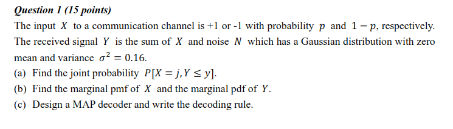
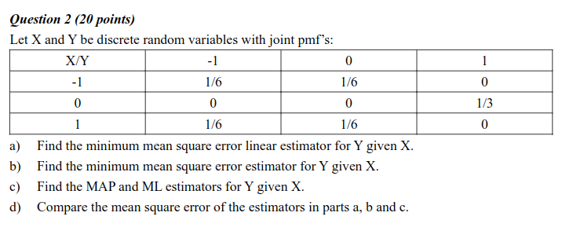
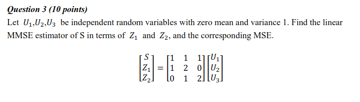
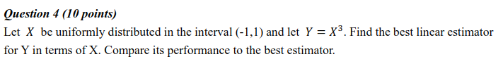
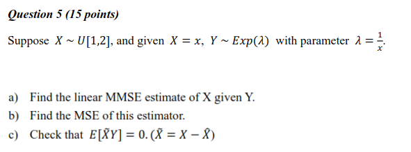
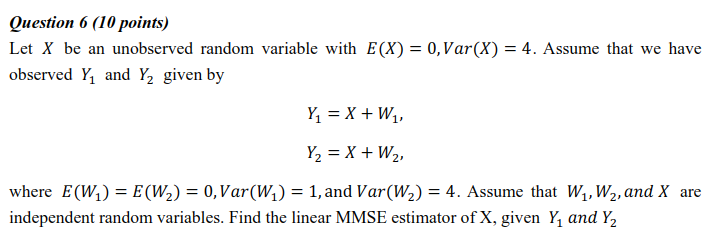
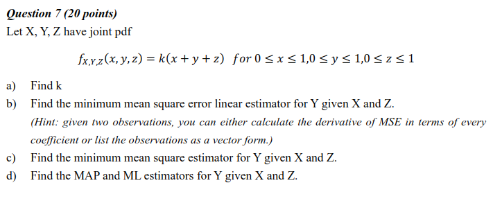

# ELEC3810 Homework 2
Name: Young, James Yang (20740589)

## Q1

$Y = X + N$

### (a)

When j = 1:

$P[X=j,Y \le y] = P[X=1, 1+N \le y] = P[X=1, N \le y-1]$

${= p*\frac{1}{0.5*\sqrt{2\pi}}*\int_{-\infty}^{y-1}e^{-\frac{x^2}{2*0.25} } dx}$

${= p*\frac{1}{0.5*\sqrt{2\pi}}*\int_{-\infty}^{y-1}e^{-2x^2 } dx}$

When j = -1:

$P[X=j,Y \le y] = P[X=-1, -1+N \le y] = P[X=-1, N \le y+1]$

${= (1-p)*\frac{1}{0.5*\sqrt{2\pi}}*\int_{-\infty}^{y+1}e^{-\frac{x^2}{2*0.25} } dx}$

${= (1-p)*\frac{1}{0.5*\sqrt{2\pi}}*\int_{-\infty}^{y+1}e^{-2x^2 } dx}$

### (b)

Marginal pmf of X:

$p_x(1) = p,\ p_x(-1) = 1-p$

Marginal cdf of Y:

$F_y(y) = P[Y \le y | x = -1]P[x=-1] + P[Y \le y | x = 1]P[x=1]$

$= P[N-1 \le y | x = -1]*(1-p) + P[N+1 \le y | x = 1]*p$

${= (1-p)*\frac{1}{0.5*\sqrt{2\pi}}*\int_{-\infty}^{y}e^{-2(y+1)^2 } dy + (p)*\frac{1}{0.5*\sqrt{2\pi}}*\int_{-\infty}^{y}e^{-2(y-1)^2 } dy}$

Marginal pdf of Y:

$f_y(y) = \frac{d}{dy}F_y(y)$

$= \frac{(1-p)}{0.5*\sqrt{2\pi}}*e^{-2(y+1)^2 } dy + \frac{p}{0.5*\sqrt{2\pi}}*e^{-2(y-1)^2 } dy$

### (c)

MAP decoder rule:

$\hat{X} = +1$ if $p_{X|Y}(X=+1|Y)>p_{X|Y}(X=-1|Y)$

$\hat{X} = -1$ otherwise

## Q2

$E[X] = 0, E[Y] = 0, E[XY]=0, E[X^2]=2/3, E[Y^2]=2/3$

$Var[X] = E[X^2]-E[X]^2 = 2/3$

$Var[Y] = 2/3$

$Cov(X,Y) = E[XY] - E[X]E[Y] = 0$

### (a)

$\hat{Y}_L=\frac{\textrm{Cov}(X,Y)}{Var(X)} (X-E[X])+ E[X]$

$=0$

### (b)

$\hat{Y}(-1) = E[Y|X=-1] = -1*1/2 + 0*1/2 + 0$

$=- 1/2$

$\hat{Y}(0) = E[Y|X=0] = 0+0+1*1$

$=1$

$\hat{Y}(1) = E[Y|X=1] = -1*1/2 + 0*1/2 + 0$

$=-1/2$

### (c)

MAP:

value of Y that maximizes: $P_{Y}(Y|X)=\frac{P(X|Y)P(Y)}{P(X)}$

$\hat{Y}(-1) =$ 0  or -1

$\hat{Y}(-1) =$ 1

$\hat{Y}(-1) =$ 0  or -1

ML:

value of Y that maximizes: $P_{X}(X|Y)=\frac{P(Y|X)P(X)}{P(Y)}$

$\hat{Y}(-1) =$ 0  or -1

$\hat{Y}(-1) =$ 1

$\hat{Y}(-1) =$ 0  or -1

### (d)

Mean Square error of (a) = 1/3

Mean Square error of (b) = 1/6

Mean Square error of (c) (ML and MAP same) = 1/3

## Q3

## Q4

f(x) = 1/2 in interval (-1,1), 0 otherwise

$E[X]  = \int_{-1}^1 x*f(x) dx = \int_{-1}^1 \frac{x}{2} dx = 0$

$E[Y]  = E[X^3] =\int_{-1}^1 \frac{x^3}{2} dx = 0$

$E[XY] = E[X*X^3] = \int_{-1}^1 \frac{x^4}{2} dx = 0$

$Cov(X,Y) = E[XY]-E[X]E[Y] = 0$

The best linear estimator for Y is:

$\hat{Y}=\frac{\textrm{Cov}(X,Y)}{\textrm{Var}(X)}+E[Y]$

$= E[Y] = 0$

the mean square error is Var[Y]

$Var[Y]=E[Y^2]-E[Y]^2$

$E[Y^2] = E[X^6] = \int_{-1}^1 \frac{x^6}{2} dx = 1/7$

$Var[Y] = 1/7$ which is the mean square error for the best linear estimator

The best estimator for Y is:

$E[Y|X=x]=E[X^3|X=x] = x^3$

with mean square error of 0, meaning that the best estimator performs better than best linear estimator.

## Q5

$E[X]=\int_{1}^{2}x*1dx = 3/2$

$E[Y] = E[E[Y|X]] = E[X] = 3/2$

$E[Y^2] = E[E[Y^2|X]]=E[2X^2] = \int_{1}^{2}2x^2*1dx=14/3$

$Var[Y]=E[Y^2]-E[Y]^2 = 29/12$

$E[XY] = \int_{1}^{2}x^2*1dx=7/3$

$Cov(X,Y) = E[XY]-E[X]E[Y] = 1/12$

### (a)

$\hat{X}_L=\frac{\textrm{Cov}(X,Y)}{\textrm{Var}(Y)} (Y-E[Y])+ E[X].$

$=\frac{1}{29}\left(Y-\frac{3}{2}\right)+\frac{3}{2}$

$=\frac{Y}{29} + \frac{42}{29}$

### (b)

$\rho^2=\frac{\textrm{Cov}^2(X,Y)}{\textrm{Var}(X) \textrm{Var}(Y)}=\frac{1}{29}$

$MSE=(1-\rho^2)\textrm{Var}(X)$

$= (1-1/29)*1/12 $

$= \frac{7}{87}$

### (c)

$\tilde{X}=X-\hat{X}_L$

$=X-\frac{Y}{29}-\frac{42}{29}$

$E[\tilde{X}Y]=E\left[\left(X-\frac{Y}{29}-\frac{42}{29}\right)Y\right]\\
=E[XY]-\frac{EY^2}{29}-\frac{42}{29}EY\\
=0$

## Q6

$E[\tilde{X}]=-aE[Y_1]-bE[Y_2]-c=-a \cdot 0- b \cdot 0-c=-c.$

Since $E[X]=0, c = 0$

$\textrm{Cov}(\hat{X}_L,Y_1) = \textrm{Cov}(aY_1+bY_2,Y_1)\\
=a \textrm{Cov} (X+W_1,X+W_1)+b \textrm{Cov} (X+W_1,X+W_2)\\
=a (\textrm{Var}(X) +\textrm{Var}(W_1))+b \textrm{Var}(X)\\
=5a +4b$

$\textrm{Cov}(\hat{X}_L,Y_2) = \textrm{Cov}(aY_1+bY_2,Y_2)\\
=a \textrm{Var}(X) +b (\textrm{Var}(X)+\textrm{Var}(W_2))\\
=4a +8b$

Since $Cov(X,Y_1)=Cov(X,Y_2)=Var(X)=4$:

$5a+4b=4$ and $4a+8b=4$, solving both equations give a = 2/3 and b = 1/6

The linear MMSE of X:

$\hat{X}_L=aY_1+bY_2+c$

$= \hat{X}_L=\frac{2}{3}Y_1+\frac{1}{6}Y_2$

## Q7

### (a)

$1=\int_{0}^1\int_{0}^1\int_{0}^1k(x+y+z)dxdydz$

$1=1.5k$

$k=2/3$

### (b)

$f(x)=\frac{2}{3}(x+1), f(x,y)=\frac{2}{3}(x+y+\frac{1}{2})$

$E[X]=E[Y]=E[Z]=\int_{0}^1f(x)*x\ dx = \int_{0}^1 \frac{2}{3}x(x+1) dx = \frac{5}{9}$

$E[XY]=\int_0^1\frac{2}{3}(x+y+\frac{1}{2})*x*y\ dxdy = \frac{11}{36}$

$Var[X]=Var[Y]=Var[Z]=E[X^2]-E[X]=\frac{13}{162}$

$Cov(X,Y) = Cov(Y,Z) = Cov(X,Z) = E[XY] - E[X]E[Y] = \frac{11}{36} - \frac{5}{9}*\frac{5}{9} = \frac{-1}{324}$

Linear Estimator:

$a=R_{XZ}^{-1}*E[XZ]$

$(a_1,a_2)^T=\begin{pmatrix} Var(x) & Cov(X,Z)\\ Cov(X,Z) & Var(Z) \\ \end{pmatrix}^{-1} \begin{pmatrix} Cov(Z,X \\ Cov(Y,Z)  \\ \end{pmatrix}$

$=\begin{pmatrix} 13/162 & -1/324\\ -1/324 & 13/162 \\ \end{pmatrix}^{-1} \begin{pmatrix} -1/324 \\ -1/324 \\ \end{pmatrix}$

$=\begin{pmatrix}
-27/705\\
-27/705  \\
\end{pmatrix}$

$\hat{Y}=(a_1,a_2)\begin{pmatrix} X-E[X]\\ Z-E[Z] \\ \end{pmatrix}+E[Y]$

$= (-27/705,-27/705)\begin{pmatrix} X-5/9\\ Z-5/9  \\ \end{pmatrix}+5/9$

$=\frac{-27}{705}(x+z)+\frac{217}{423}$

Mean Square Error:

$= Var[X] - a^T\begin{pmatrix} Cov(X,Y) \\ Cov(Y,Z) \\ \end{pmatrix}$

$=\frac{13}{162}-\frac{1}{1410}$

$= \frac{1514}{19035}$

### (c)

$f(y|x,z)=\frac{(x+y+z)}{(x+y+0.5)}$, $0<y<1$

$E[Y|X,Z]=\int_0^1\frac{(x+y+z)*y}{x+y+0.5}dy=\frac{0.5(x+z)+\frac{1}{3}}{x+y+0.5}$

MMSE Estimator for Y given X and Z:

$\hat{Y}=\frac{0.5(x+z)+\frac{1}{3}}{x+y+0.5}$

### (d)

ML Estimator:

$\hat{Y}=1$ if $x+z<1$

$\hat{Y}=0$ if $x+z>1$

