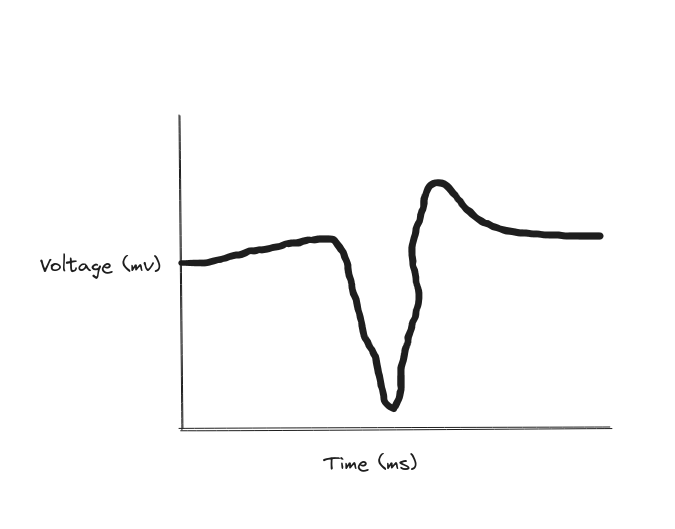

# Homework 3
Name: Young, James Yang (20740589)

### Q1. How fast can a neuron generate action potentials?  Please explore 3-5 cortical areas and compare the average firing rates (the number of the action potential per second) , and list in a table.

Many neurons can generate action potentials at a rate of up to 10–100 action potential per second. Below are 4 areas:

| Cortical Area           | Firing Rate (action potential per second) |
|-------------------------|-------------------------------------------|
| Primary Visual Cortex   | 10-20                                     |
| Prefrontal Cortex       | 1-10                                      |
| Motor Cortex            | 10-40                                     |
| Primary Auditory Cortex | 5-30                                      |

### Q2. Please do the research and draw the figure of relative time course of changes in membrane voltage during an action potential (refer Figure 2.11b in textbook page 31) when recorded EXTRACELLULARLY.  Use one or two cortical area as examples. Explain why there is the signal difference (in terms of amplitude range and time delay of the peak) between extracellular recording and intracellular recording. How does the difference impact your estimation on the neural action potential.

Example figure of relative time course of changes in membrane voltage during an action potential recorded extracellularly:

Intracellular recordings measure the voltage change across the neuron's membrane from the inside of the neuron. Extracellular recordings, on the other hand, measure the potential changes at the membrane surface rather than across the membrane. This means that it measures the electric field caused by the flow of ions across the neuronal membrane. Because of this, the amplitude of the recorded signals are usually smaller than in intracellular recordings.

Also, the timing of the peaks can be different because extracellular recordings are influenced by the spatial distribution of the currents flowing through the neuron's membrane and the distance of the recording electrode from the neuron. This can lead to a delay in the timing of the peaks and the shape of the signal as compared to intracellular recordings.

This difference can impact estimation on neural action potential. The difference in amplitude means that the threshold for initiating action potential of the extracellular recording will be different and needs to be adjusted. 

<!-- *Q2 Hint： Try to use a system model to describe the extracellular recording as the system observation/output and the intracellular membrane potential as the system input. Please refer to example of “Additive Gaussian noise channel” as we demonstrate in the class. Please write clear about the assumptions.

*This is a mini-writing assignment. Please do not just give simple numbers as your answer. Try to be motivated with your curiosity, and research as much as you can.  -->